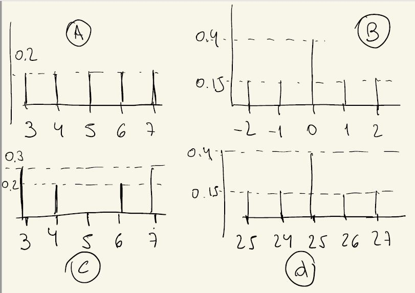

```{r setup, include=FALSE}
knitr::opts_chunk$set(echo = TRUE)
```

# 1. Videos 4.
1. Sea X una variable aleatoria con rango $R_X= \{-3, -1, 4, 7\}$. En la hoja Ejercicio 1 del documento compartido ubicado en este enlace encontrará, en la fila con su apellido y nombre, los valores de probabilidad puntual p_X (k) para k = -3, -1, 7. Con esos valores, resuelva los siguientes ítems.
a) Calcule la esperanza de X y complete en la columna correspondiente.
b) Sea Y = 3X + X^2 . Halle E(Y) y complete en la columna correspondiente.

\underline{Resolución:}

```{r}
rango_X=c(-3,-1,4,7)
puntuales_X=c(0.35,0.25,0.2,0.2)
esperanza_X=sum(rango_X*puntuales_X)
esperanza_X
esperanza_del_cuadrado_X=sum(rango_X^2*puntuales_X)
esperanza_del_cuadrado_X
g=function(x){
  3*x+x^2
}
rango_Y=g(rango_X)
esperanza_Y=sum(rango_Y*puntuales_X)
esperanza_Y
esperanza_del_cuadrado_Y=sum(rango_Y^2*puntuales_X)
esperanza_del_cuadrado_Y
plot(rango_X,puntuales_X,col='blue',ylim=c(-0.1,1), pch=20,
     main='Proba puntual X', xlab = 'Rango', ylab='Puntuales')
points(esperanza_X,0,col='red', pch=19)
```

XQ NO ME GRAFICA EL OTRO PUNTO EN ROJO? XQ EL PUNTO ESTABA FUERA DEL EJE Y (ES UN PUNTO GORDITO).

\clearpage

2. Cierta proporción de piezas producidas por una fábrica presentan defectos. Sea X la cantidad de defectuosas al revisar un lote de n piezas. Calcular la esperanza de X utilizando los valores que le asignamos en la hoja Ejercicio 2 e incluya la respuesta en la columna D.

\underline{Resolución:}

X representa la cantidad de piezas defectuosas de un lote de n piezas. En mi caso n=7 y el porcentaje de piezas defectuosas es del 15%, es decir, P(X=1)=0.15 y es un espacio equiprobable.

```{r}
esperanza_2=sum((1:7)*rep(0.15,7))
esperanza_2
esperanza_del_cuadrado_2=sum((1:7)^2*rep(0.15,7))
esperanza_del_cuadrado_2
```


\clearpage

3. A continuación se muestran gráficos de probabilidades puntuales de variables aleatorias, ordene (y no haga cuentas) los gráficos de manera de observar crecimiento en la varianza de las variables.


\underline{Resolución:}

Todas las variables tienen varianza 0 porque como el rango de cada una tiene punto medio y las probas puntuales estan distribuidas de forma simetrica respecto de este punto medio, entonces la esperanza será este punto medio y luego la varianza es 0 (xq la variable al cuadrado cumplira lo mismo y como los rangos los elevamos al cuadrado tendremos esperanza_del_cuadrado=punto_medio^2 =esperanza_X^2).

EL C TIENE MAS VARIANZA PORQUE TIENE LOS DATOS MAS DESPARRAMADOS. B Y D SON LAS MAS CHICA. ES DECIR, B = D < A < C.

\clearpage

4. Calcule la varianza de la variable X definida en el ejercicio 1 y en el ejercicio 2; incluya las respuestas en las columnas incluídas a tal efecto en las hojas Ejercicio 1 Ejercicio 2, respectivamente, del documento compartido. 

\underline{Resolución:}

```{r}
varianza_X=esperanza_del_cuadrado_X-esperanza_X^2
varianza_X
varianza_Y=esperanza_del_cuadrado_Y-esperanza_Y^2
varianza_Y
varianza_2=esperanza_del_cuadrado_2-esperanza_2^2
varianza_2
```


\clearpage

5. Se lanzan dos dados equilibrados y se anotan los números de las caras observadas. Sea X la variable aleatoria suma de los resultados obtenidos. Calcule probabilidad puntual, esperanza y varianza de X.

\underline{Resolución:}

Si k<=7, P(X=k)=(k-1)/36.

Si k>=8, P(X=k)=P(X=12-(k-2)) porque la cantidad de casos favorables para k>=8 coincide con los casos favorables para k<=6 porque el espacio muestral es equiprobable y simétrico respecto de k=7. 

Luego P(X=k)=P(X=12-(k-2))=(12-(k-2)-1)/36=(12-(k-1))/36, por el caso anterior (12-(k-2)<=7 si k>=8).

```{r}
puntual_5=function(k){
  if(k<=7){(k-1)/36}else{(12-(k-1))/36}
}
rango_5=(1:12)
puntuales_5=unlist(lapply(rango_5,puntual_5), recursive = FALSE)
puntuales_5
# unlist(lista_de_listas, recursive=FALSE) transforma 
# la lista_de_listas en una sola lista
esperanza_5=sum(rango_5*puntuales_5)
esperanza_5
esperanza_del_cuadrado_5=sum(rango_5^2*puntuales_5)
esperanza_del_cuadrado_5
varianza_5=esperanza_del_cuadrado_5-esperanza_5^2
varianza_5
```


\clearpage

# 2. Videos 5.
6. En un juego de tiro al blanco, la distancia al centro (en cm.) que obtiene Juan se considera una variable aleatoria X con la siguiente función de distribución acumulada:

$$F_X(t)=
\begin{cases}
0 & \text{ si } t<0 \\
\frac{t^2}{144} & \text{ si } 0\leq t< 12 \\
1 & \text{ si } t\geq 12
\end{cases}=\frac{t^2}{144}\chi_{(0,12)}+\chi_{[12,\infty)}$$

```{r}
F_X=function(t){
  if(t<0){0}else if(0<= t & t<12){t^2/144}else{1}
}
grilla=seq(-3,15,0.1)
plot(grilla,lapply(grilla, F_X),type='l',col='blue',
     main='Distribución acumulada',
     xlab='Rango', ylab='Probabilidad acumulada')
```


a) Hallar la probabilidad de que un tiro de Juan diste menos de 1 cm. del blanco.

\underline{Resolución:}

$P(X<1)=P(X\leq 1)$ pues X es continua, luego $P(X<1)=F_X(1)$.

```{r}
F_X(1)
```


b) Hallar la probabilidad de que un tiro de Juan diste menos de 1 cm. del blanco si se sabe que dista del blanco a los sumo 2cm. Comparar con la probabilidad anterior.

\underline{Resolución:}

$P(X< 1|X\leq 2)=\frac{P(X< 1,X\leq 2)}{P(X\leq 2)}=\frac{F_X(1)}{F_X(2)}$

```{r}
F_X(1)/F_X(2)
```

Esta proba es bastante mas grande que la del item anterior
```{r}
F_X(1)/F_X(2)-F_X(1)
```


c) Hallar E(X) y V(X).

\underline{Resolución:}

Recordemos que $E(X)=\int t f_X(t)dt$. Calculo entonces la densidad $f_X$ derivando la función de distribución acumulada. Tenemos

$$f_X(t)=
\begin{cases}
0 & \text{ si } t<0 \\
\frac{t}{72} & \text{ si } 0\leq t< 12 \\
0 & \text{ si } t\geq 12
\end{cases}=\frac{t}{72}\chi_{(0,12)}$$

Con lo cual 
\begin{align*}
  E(X)&= \int t f_X(t) dt = \frac{1}{72}\int_0^{12} t^2 dt = \frac{1}{3.72}.12^3=8;\\
  E(X^2)&=\int_0^{12} t^2 f_X(t) dt = \frac{1}{72}\int_0^{12} t^3 dt = \frac{1}{4.72}.12^4=72;\\
  V(X)&=E(X^2)-E(X)^2=72-8^2=8.
\end{align*}

```{r}
f_X=function(t){
  if(t<0){0}else if(0<= t & t<12){t/72}else{0}
}
```


d ) Hallar el percentil (o cuantil) 0.90 de la distribución X.

\underline{Resolución:}

Queremos a tal que $P(X\leq a)=0.9$, es decir tal que $0.9=F_X(a)=a^2/144$ entonces $a=\sqrt(0.9*144)=11.38$.

## Bonus Track - Para seguir pensando

e) En el pub se organiza un juego que otorga un premio de $120 - 10X para cada lanzamiento al blanco, donde X es la distancia conseguida, y para participar se
deben pagar $45 por cada intento. Calcule la esperanza y la varianza de la ganancia neta para Juan.

\underline{Resolución:}

Sea $Y=120-10X-45=75-10X$ el premio del juego.

\begin{align*}
  E(Y)&=75-10E(X)=75-10.8=-5;\\
  V(Y)&=10^2V(X)=100.8=800.
\end{align*}


f ) ¿Cuál es la probabilidad de que la gananacia neta sea mayor que la ganancia neta esperada?

\underline{Resolución:}

$P(Y>E(Y))=P(Y>-5)=P(10X<80)=P(X<8)=F_X(8)$.

```{r}
F_X(8)
```


g) Juan tira 12 veces al blanco, ¿cuál es la probabilidad de que dos o menos de sus tiros disten menos de 1 cm. del blanco?

\underline{Resolución:}

Queremos la proba de que dos o menos de los 12 tiros disten menos de 1 cm. del blanco. Como los 12 lanzamientos son independientes y con la misma distribución podemos pensarlos como $X_1,\dots,X_12$ i.i.d. y queremos entonces 
\begin{align*}
P(X_i<1)+P(X_i<1,X_j<1)&=P(X_i<1)+P(X_i<1)P(X_j<1)={12 \choose 1}P(X<1)+{12 \choose 2}P(X<1)^2.
\end{align*}

```{r}
choose(12,1)*F_X(1)+choose(12,2)*F_X(1)^2
```

\clearpage

# 3. Videos 6.
7. La cantidad de tiempo, en minutos, que una persona debe esperar el colectivo de una cierta línea los días de semana por la mañana es una variable aleatoria con distribución uniforme en el intervalo [0, 15].
a) ¿Cuál es la probabilidad de que espere entre 5 y 10 minutos?

\underline{Resolución:}

Tenemos entonces $U=\mathcal{U}(0,15)$. Entonces $P(5\leq U\leq 15)=\int_5^{15}f_U(s)ds=F_U(15)-F_U(5)$ donde 
\begin{align*}
f_U(x)&=
\begin{cases}
\frac{1}{b-a} & \text{ si } a\leq x\leq b \\
0 & \text{ si no}
\end{cases}
=
\begin{cases}
\frac{1}{15} & \text{ si } 0\leq x\leq 15 \\
0 & \text{ si no}
\end{cases} \\
F_U(x)&=\int_{a}^{x}f_U(s)ds=\frac{x-a}{b-a}=\frac{x}{15}
\end{align*}


```{r}
f_U=function(x){dunif(x,0,15)}
F_U=function(x){punif(x,0,15)}
# una forma
integrate(f_U,5,15)
# otra forma
F_U(15)-F_U(5)
```


b) ¿Cuál es la media del tiempo de espera?

\underline{Resolución:}

Queremos $E(U)$.

```{r}
xf_U=function(x){x*f_U(x)}
integrate(xf_U,0,15)
```


c) Aproximadamente el 80 % de las veces espera menos de ........... minutos. Completar y justificar.

\underline{Resolución:}

Queremos el valor del tiempo t que hace que el 80% de las veces que toma el colectivo, espere menos de t, es decir queremos el percentil $t_{0.8}$. O sea queremos el tiempo $t_{0.8}$ tal que $P(U\leq t_{0.8})=0.8$:
$$0.8=F_U(t_{0.8})=\frac{t_{0.8}}{15} \longrightarrow t_{0.8}=0.8.15=12.$$

```{r}
0.8*15
```

\clearpage

8. La medida, en centímetros, de la longitud de la cintura de los hombres en Buenos Aires sigue una distribución normal con media 75 y varianza 25. Se sabe que todos los hombres de menos de 70 cm. de cintura usan cinturón de talle 1, mientras que los de cintura entre 70 y 81 cm. usan talle 2 y los restantes talle 3.
a) ¿Qué proporción de hombres usa cinturón de talle 2?

\underline{Resolución:}

Tenemos entonces $N=\mathcal{N}(75,5)$ donde
\begin{align*}
  N\leq 70 &\longrightarrow \text{talle 1} \\
  70 < N\leq 81 &\longrightarrow \text{talle 2} \\
  81<N &\longrightarrow \text{talle 3}
\end{align*}

```{r}
f_N=function(x){dnorm(x,mean=75,sd=sqrt(25))}
F_N=function(x){pnorm(x,mean=75,sd=sqrt(25))}
par(mfrow=c(1,2))
grilla=seq(75-5*sqrt(25),75+5*sqrt(25),1)
plot(grilla,lapply(grilla,f_N),type='l',main='Densidad',
     xlab='Rango', ylab='Densidad', col='blue')
plot(grilla,lapply(grilla,F_N),type='l',main='Distribución acumulada',
     xlab='Rango', ylab='Proba acumulada', col='blue')
par(mfrow=c(1,1))
```

Nos piden calcular la proporción de hombres que usa cinturón de talle 2, es decir, $P(70< N\leq 81)=F_N(81)-F_N(70)$.

```{r}
F_N(81)-F_N(70)
```


b) ¿Cuál debería ser la longitud máxima de cintura del talle 1 si se quiere que el
30 % de los hombres use talle 1?

\underline{Resolución:}

Queremos el percentil $x_{0.3}$, es decir, el valor $x_{0.3}$ tal que $F_N(x_{0.3})=0.3$:
$$0.3=F_N(x_{0.3})=\int_{-\infty}^{x_{0.3}}f_N(s)ds$$
Uamos el comando QNORM(CUANTIL,MU,SIGMA).

```{r}
qnorm(0.3,mean=75,sd=5)
```


\clearpage

# Bonus Track - Para seguir pensando

9. Considerar nuevamente el enunciado del ejercicio 7. Ahora una persona debe tomar el colectivo a las 8:30 para llegar a tiempo a su trabajo.
a) ¿A qué hora debería llegar a la parada para tener 0,8 de probabilidad de llegar a tiempo?

\underline{Resolución:}

Dada una probabilidad p lo que podemos calcular es el tiempo $t_p$ que espera una persona el 100.p % de las veces. Con lo cual si queremos que una persona llegue a tiempo el 100.p % de las veces como ese % de veces si o sí va a esperar un tiempo $t_p$ entonces debe salir de la casa un tiempo $t_p$ antes. 

O sea, sabemos que el 80% de las veces una persona espera menos de $t_{0.8}$, entonces para que la persona llego a tiempo el 80% de las veces necesitamos que llegue a la parada a las $8:30 - t_{0.8}=8:30-12m=8:18$.


b) Supongamos que la persona llega a la parada todas las mañanas a la hora calculada en el item anterior.¿Cuál es la probabilidad de que no llegue tarde ningún día de una semana? ¿Cuál es la probabilidad de que llegue tarde exactamente dos días de una semana?

\underline{Resolución:}

Podemos pensar el tiempo de espera de cada día como una variable U, es decir, tenemos $U_1,\dots,U_7$ i.i.d. Entonces la probabilidad de que no llegue tarde ningún día de la semana es la probabilidad de que todos los dias espere menos de $t_{0.8}$ (digo, como la persona está en la parada todos los dias a las $8:18$ entonces si un dia espera mas de $t_{0.8}$ va a llegar tarde), es decir
$$P(U_1\leq t_{0.8},\dots,U_7\leq t_{0.8})=P(U_1\leq t_{0.8})^7=0.8^7.$$

La probabilidad de que llegue tarde exactamente dos días de la semana es
$$P(U_i> t_{0.8},U_j>t_{0.8})={7 \choose 2}P(U_1>t_{0.8})^2={7 \choose 2}0.2^2$$


c) Supongamos que la persona llega a la parada todas las mañanas a la hora calculada en el ítem 9 a). Sea D la variable aleatoria que cuenta el número de días laborables que deben pasar hasta que llegue tarde al trabajo por primera vez. Indicar que distribución tiene D y cuál es su esperanza.

\underline{Resolución:}

Sea D= # dias laborales que deben pasar hasta que llegue tarde por primera vez. Notar que D podemos pensarla como la cantidad de experimentos que hay que realizar hasta obtener un exito, donde la probabilidad de obtener un exito es 0.2. Es decir $D=\mathcal{G}(0.2)$ donde la esperanza sabemos que es $\frac{1}{0.2}=5$.

\clearpage

10. Considerar el enunciado presentado en el ejercicio 8 y responder los siguientes puntos.
a) Carolina sabe que la cintura de su novio mide más de 70 cm. ¿Cuál es la probabilidad de que use talle 2?

\underline{Resolución:}

Sabemos que $N>70$ entonces queremos 
\begin{align*}
P(70<N\leq 81|N>70)&=\frac{P(70<N\leq 81,N>70)}{P(N>70)}\\
&=\frac{P(70<N\leq 81)}{P(N>70)}\\
&=\frac{F_N(81)-F_N(70)}{1-F_N(70)}
\end{align*}

```{r}
(F_N(81)-F_N(70))/(1-F_N(70))
```


b) Si en la tienda entran azarosamente hombres a comprar de a un cinturón, ¿cuál es la probabilidad de que los primeros tres cinturones que se vendan sean del mismo talle?

\underline{Resolución:}

Supongamos que en la tienda se vendieron k cinturones. Podemos modelar este fenómeno tomando $N_1,\dots,N_k$ i.i.d. Y queremos entonces la probabilidad de que $N_1,N_2,N_3$ se muevan entre los mismo valores (o sea que las 3 primeras ventas son del mismo talle). Entonces queremos

$$P=P(N_i\leq 70, 1\leq i\leq 3)+P(70 < N_i\leq 81, 1\leq i\leq 3)+P(81 < N_i, 1\leq i\leq 3).$$

Como son variables i.i.d tenemos

$$P=P(N\leq 70)^3+P(70<N\leq 81)^3+P(81<N)^3$$

```{r}
F_N(70)^3+(F_N(81)-F_N(70))^3+(1-F_N(81))^3
```

